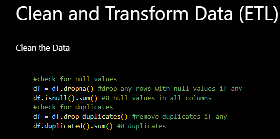
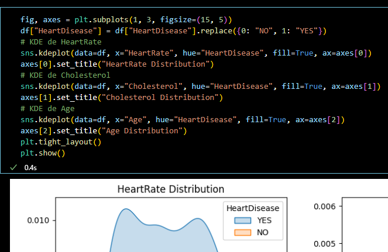
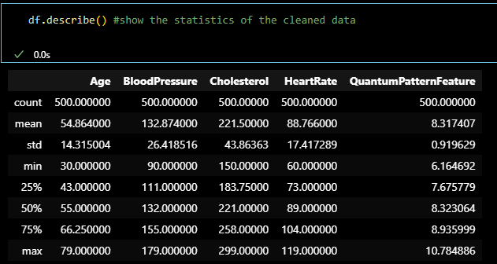
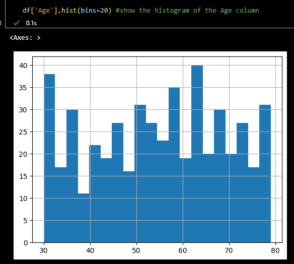
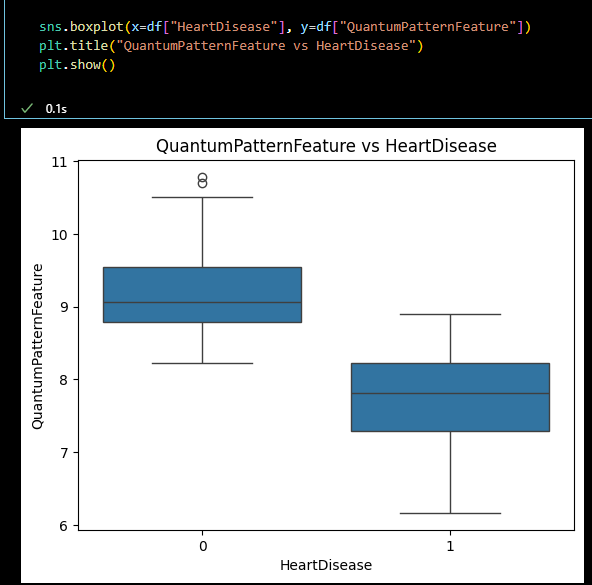
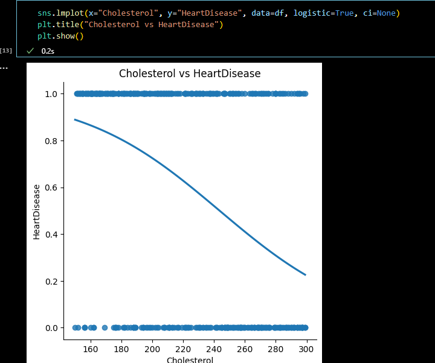
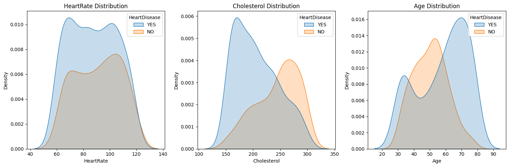
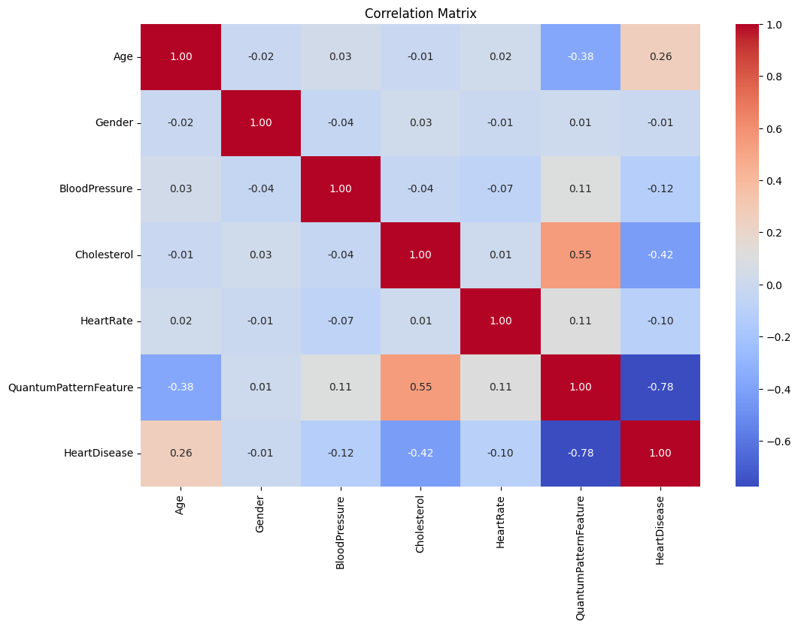
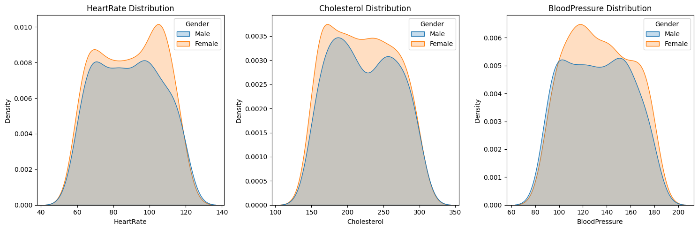

# Heart Prediction

**Heart Prediction** This project has been made as part of the first assesment within the Data Analyst course provided by Code Institute. This will be my first project and represent what i have learn so far.

In this project i will document step by step what is happening from Data cleaning to visualization.

# 

## Dataset Content
* The dataset is sourced from Kaggle.

**What is Kaggle?**

* Kaggle is an online community platform for data scientists and machine learning enthusiasts.
* Kaggle allows users to collaborate with other users, find and publish datasets, use GPU integrated notebooks, and compete with other data scientists to solve data science challenges.

This document contains 500 Rows on 7 columns and represents diferent people with varieties of Gender, Cholesterol, HeartDisease etc...

## Business Requirements
* The goal of this analysis is to predict the likelihood of Heart disease in patients based on various medical attributes
* The project aims to create visual insights into the key factors influencing Heart disease predictions.

## Hypothesis and how to validate?
* Key factors suchs as Age, Cholesterol levels, blood pressure significantly influence the likehood of Heart Disease
* Validation will be carried out by analyzing the correlation between features and heart disease occurrence. 

## Project Plan
**High-level steps**
* Load and clean the dataset
* Transform Data if needed
* Create visualizations to interpret results
* Conduct a correlation analysis to indentify the most influential features
* Document Findings
**Data Management**
* The data is sourced from the Kaggle Dataset "Heart-Prediction-dataset-quantum".
* Data was cleaned, missing values handled
* Statistical analysis was conducted using Pandas and Numpy
* Insights were created using Matplotlib and Seaborn
* They are usefull tools and easy to use.

## The rationale to map the business requirements to the Data Visualisations
* Identifying the primary features influencing heart disease prediction.
* A correlation matrix, KDE and scatter plots were created to hihlight relationships between variables like cholesterol, age and blood pressure
* Histograms and KDE Plots used to explore the distributions of key features like age and cholesterol.

## Analysis techniques used
* Descriptive statistics, histograms and correlation matrix
* correlation matrix heatmap to observe relationships between features
* KDE plots to compare feature distributions by HeartDisease status.
* Logistic Regression model to explore the relationship between Cholesterol and HeartDisease
* How did you structure the data analysis techniques. Justify your response.
I started by checking for any missing data and removed rows containing null values (There was none) 
after that i ensured there were no duplicated rows to avoid biases in the analysis.

I was prepared for the step of replacement categorical values like "HeartDisease" and "Gender" to numericals columns to (0 and 1) with more descriptive labels "NO" and "YES" for easier interpretation of visualizations but the dataset were already prepared so i just needed to label it later.

After the cleaning i explored the data using descriptive statistics to understand the distribution of values like Age, Cholesterol and HeartRate. 

I visualized the data using histograms and boxplots. 
  
Make correlation analysis to identify wich features had a significant relationship with the target variable "HeartDisease". I created Scatter plots, KDE plots and logistic regressions to show how the features are distributed by HeartDisease status.

Correlation Heatmap was used to visualize it better.

* Did the data limit you, and did you use an alternative approach to meet these challenges?
The dataset used is relatively small and may not capture the variability in the population. More data could improve sustancially the accuracy. Specially because there were significantly more "YES" Than "NO" in HeartDisease, wich can impact the prediction.
* How did you use generative AI tools to help with ideation, design thinking and code optimisation?
AI was useful wen i sought suggestions on how to aproach the analysis and what questions make about the project 
## Ethical considerations
* The dataset is anonymized, so no personal data was involved. 
* The Dataset was pretty much leveled across Genders and HeartDiseases
* I ensure the use of publicly available data without violating privacy regulations

## Unfixed Bugs
* There were no major unfixed bugs, but there is room for improvement in handling certain parts of the code
* A lot of them, it was a show of how much i have learn and i needed to come back to the Code Institute web page and w3school to fix certain parts

## Development Roadmap
* At first i use another Dataset, but it has an excesive amount of information and i could not make it work so in the end i try to solve it using another Dataset. The archive "Prueba.py" its were the previous code/project is alocated for me to review at a later date and its not relevant to the content of this project
* Learn more about machine learning and explore advanced data preprocessing techniques to handle imbalances in the dataset.

## Main Data Analysis Libraries
* Pandas: For data manipulation
* Numpy: For numerical operations
* Matplotlib and Seaborn: For visualization of the data
* statsmodels for statistical modeling

## Credits 

* Kaggle tutorials and dataset
* w3 tutorials
* code institute tutorials

### Content 

* the Dataset was extracted from the https://www.kaggle.com/datasets/shantanugarg274/heart-prediction-dataset-quantum/data

## Acknowledgements (optional)
* Thank the people who provided support through this project.